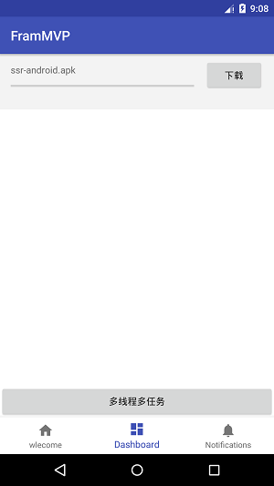
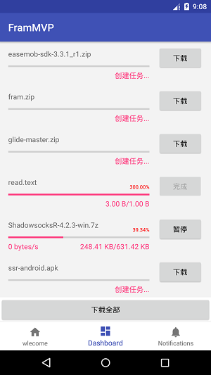
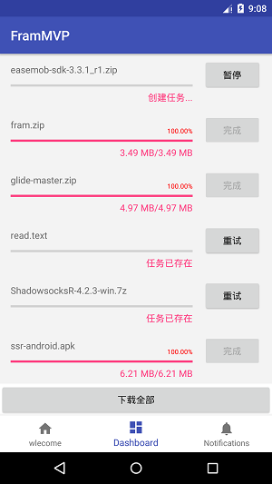
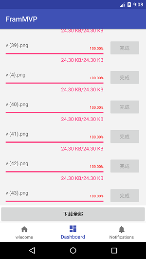

FramMvp
=====

MVP RXJava 基础架构

构建的断点下载器
------
1.单文件下载是走的qq Apk

2.多文件下载：自建服务器

服务器连接地址 [JSSMForFramMVP](https://github.com/ybADMIN/JSSMForFramMVP)

Author
------
Eric Yang - @ybADMIN on GitHub, yb498869020@hotmail.com on Email

License
-------
Copyright 2017 Eric Yang

Licensed under the Apache License, Version 2.0 (the "License");
you may not use this file except in compliance with the License.
You may obtain a copy of the License at

http://www.apache.org/licenses/LICENSE-2.0

Unless required by applicable law or agreed to in writing, software
distributed under the License is distributed on an "AS IS" BASIS,
WITHOUT WARRANTIES OR CONDITIONS OF ANY KIND, either express or implied.
See the License for the specific language governing permissions and
limitations under the License.
